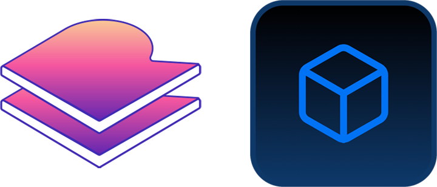

<p align="center">
  <a href="https://github.com/renchris/replicache-introduction-demo">
    
  </a>
</p>
<h1 align="center">
  Replicache Demo With NextJS
</h1>

A NextJS App Router project that follows the Replicache Demos: Todo Row Versioning, Introduction, and Build Your Own Back End.

Please refer to the `main` branch for the Todo Row Versioning Demo, the `turso-database` branch for Turso as the database driver, and `build-your-own-backend` branch for the Introduction and  Build Your Own Back End Demos.

## 🥞 Stack Changes from Demos

- Vanilla JavaScript → NextJS App Router with `use server` and `use client` components

- PandaCSS

- Postgres → Drizzle + SQLite (Turso)

- Pusher → Soketi

## ⏩ NextJS App Router

The significant feature of Next.js App Router is [Server Components](https://nextjs.org/docs/app/building-your-application/rendering/server-components).

This allows more of your application to receive the [benefits of server rendering](https://nextjs.org/docs/app/building-your-application/rendering/server-components#benefits-of-server-rendering).

## 🐼 PandaCSS

[PandaCSS](https://panda-css.com/) is our preferred UI framework. It was launched by the Chakra UI team with the developer experience, semantics, and readability like with Chakra UI and zero runtime CSS-in-JS for Server Components compatibility like with TailwindCSS.

## ☔️ Drizzle + SQLite

We use [Drizzle](https://orm.drizzle.team/docs/overview) as our ORM that is lightweight, performant, and SQL-like with our local database of choice: SQLite.

Once the database is initialized, you may use [Drizzle Studio](https://orm.drizzle.team/drizzle-studio/overview) to see our tables.

First, run the command:

```bash
pnpm drizzle-kit studio
```

Which will run at a local address:

```bash
Drizzle Studio is up and running on http://0.0.0.0:xxxx
```

Open the URL in your browser to see our tables and data.

## 🔌 Pusher and Soketi

We use [Soketi](https://soketi.app/) for our web socket service to send and receive pokes. When we push data, send a poke to notify all other applications to pull for the updated data. No data is actually sent with pokes.

While we use Soketi to host our websocket endpoint server we still use the [Pusher SDK](https://pusher.com/docs/channels/library_auth_reference/pusher-websockets-protocol/). However, our endpoint is now our self-hosted Soketi server instead of Pusher's priced and managed service server.

We need to use the [Pusher JS library](https://github.com/pusher/pusher-js) for instances and functions on the client side and the [Pusher library (pusher-http-node)](https://github.com/pusher/pusher-http-node) for instances and functions on the server side.

Note that the Pusher client instance parameters are slightly different between the client `pusher-js` library and the server `pusher` library.

We do not need a Pusher account or app.

We don't need soketi as a project dependency of our NextJS application but have access to running a Soketi server through their command line.

The fields of the app id, key, and cluster are required parameters but the values are insignificant and aren't used.

The important parameter values are port and host.

We use `soketi start` to start our local Soketi server.

In production, we would continually run our soketi server in a container by way of command line or docker file in a virtual instance such as AWS EC2/ECS, Fly.io, or Digital Ocean.

## 🚀 Usage

Install the application dependencies:

```bash
pnpm install
```

### 🔌 Start Your Soketi Server

Install the Soketi command line:

```bash
pnpm install -g @soketi/soketi
```

Then, run the local Soketi server:

```bash
soketi start
```

### 🔑 Generate your Replicache License Key

Run the command:

```bash
pnpm dlx replicache@latest get-license
```

Then, add your key to your `.env.local` file.

```bash
REPLICACHE_LICENSE_KEY=your-license-key-here
```

### 📘 Initialize your database

Run the Drizzle push command:

```bash
pnpm push
```


### 🚀 Run the application

Run the command:

```bash
pnpm dev
```

Ensure that the host and port is of the same in the Soketi server as the NextJS application.

Open [http://localhost:3000](http://localhost:3000) with your browser to see the result.

You can start editing the page by modifying `app/page.tsx`. The page auto-updates as you edit the file.

You may comment out the `<IntroductionDemo/>` component or the `<Chat/>` component to run the respective code for the Introduction Demo or the Bring Your Own Back End (Chat) Demo.

## 🎨 Code Style

We use ESLint for our code style. You may modify the ESLint rule set in the `.eslintrc.js` file. Include ESLint On Save in your code editor Preferences settings.

```JSON
{
    "editor.codeActionsOnSave": {
        "source.fixAll.eslint": true
    }
}
```

See

- [ESLint Rules](https://eslint.org/docs/latest/rules/)
- [Airbnb ESLint Style Guide](https://github.com/airbnb/javascript)
- [TypeScript ESLint Rules](https://typescript-eslint.io/rules/)

## 🧐 What's inside?

A quick look at the top-level files and directories where we made our feature changes in the project.

    drizzle
    ├── db.ts
    ├── initializeDatabase.ts
    └── schema.ts
    recipes
    └── table.recipe.ts
    replicache
    ├── constructor.ts
    ├── license.ts
    ├── mutators.ts
    └── types.d.ts
    src
    └── app
         ├── api
         |    ├── replicache-pull/route.ts
         |    └── replicache-push/route.ts
         ├── list
         |    └── [listIDSlug]
         |          └── page.tsx
         ├── actions
         |    └── replicache
         |          ├── appActions.ts
         |          ├── listenActions.ts
         |          ├── pokeActions.ts
         |          ├── pullActions.ts
         |          ├── pushActions.ts
         |          ├── sharedActions.ts
         |          └── todoActions.ts
         ├── layout.tsx
         ├── page.tsx
         ├── components
         |    ├── park-ui
         |    |    ├── ...
         |    |    └── ...
         |    ├── ...
         |    └── ...
         └── lib
              ├── create-replicache-context.tsx
              └── create-style-context.tsx
              
    drizzle.config.ts
    panda.config.ts

1. **`/drizzle`**: This directory will contain the code related to setting up and calling our SQLite database with Drizzle.

1. **`drizzle/db.ts`**: This file contains our server ID and SQLite database object.

1. **`db/initializeDatabase.ts`**: This file initializes our database by inserting `server ID: 1` and `version: 1` into our replicacheServer table.

1. **`drizzle/schema.ts`**: This file contains our Drizzle schema that declares our table fields and the typescript type definitions of our tables.

1. **`recipes/`**: This directory will contain the recipe files for us to apply and override any new styles over our preset styles of our Ark UI / Park UI components

1. **`recipes/table.recipe.ts`**: This file contains the Table component styles to apply and override from the Park UI Panda Preset styes.

1. **`/replicache`**: This directory will contain the code related to Replicache.

1. **`replicache/constructor.ts`**: This file declares our Replicache objects.

1. **`replicache/license.ts`**: This file contains our tutorial license key.

1. **`replicache/mutators.ts`**: This file contains the CRUD functions that interact with our local IndexedDB in-browser database.

1. **`replicache/types.d.ts`**: This file contains our type definitions for our content data: Message and MessageWithID

1. **`/src/app`**: This directory will contain all of the code related to what you will see on the front-end of the site. `src` is a convention for “source code” and `app` is the convention for “app router”.

1. **`/src/app/api`**: This directory will contain our API Route Handlers.

1. **`/src/app/api/replicache-pull/route.ts`**: This file is our API Route Handler that processes our Pulls. It returns an object of the list of getLastMutationIDChanges, the current version, and the list of put/delete operations to update to latest.

1. **`/src/app/api/replicache-push/route.ts`**: This file is our API Route Handler that processes our Pushes. It applies the latest mutations (messages submitted) and updates the latest version. It sends a poke to notify all other clients to pull for update changes.

1. **`src/app/list/[listIDSlug]/page.tsx`**: This file contains the code for the list pages at the `/list/{listID}` page routes. See [NextJS Documentation: Pages](https://nextjs.org/docs/app/building-your-application/routing/pages-and-layouts#pages)

1. **`src/app/layout.tsx`**: This file contains the Root Layout. The JSX elements in this file applies onto all routes with routes being `{children}`. See [NextJS Documentation: Layouts](https://nextjs.org/docs/app/building-your-application/routing/pages-and-layouts#layouts)

1. **`src/app/page.tsx`**: This file contains the code for the home root front-end page. See [NextJS Documentation: Pages](https://nextjs.org/docs/app/building-your-application/routing/pages-and-layouts#pages)

1. **`src/app/actions/replicache`**: This directory will contain all of our server action files related to Replicache.

1. **`/appActions.ts`**: This file contains the CRUD functions that interact with Drizzle and our remote SQLite database.

1. **`/listenActions.ts`**: This file contains the Pusher client-side helper function to listen for pokes.

1. **`/pokeActions.ts`**: This file contains the Pusher server-side helper function to send pokes.

1. **`/pullActions.ts`**: This file contains the process pull helper functions.

1. **`/pushActions.ts`**: This file contains the process push helper functions.

1. **`/sharedActions.ts`**: This file contains the helper functions that relate to Client Group that are both used by process pull and process push.

1. **`/todoActions.ts`**: This file contains the helper functions that wrap around the replicache mutators that are called by our Todo component.

1. **`/components`**: This directory will contain all of our front-end TSX components used in our Layout and Pages.

1. **`/components/park-ui`**: This directory will contain all of our Ark UI / Park UI components. See [Ark UI Documentation](https://ark-ui.com/docs/overview/introduction) and [Park UI Documentation](https://park-ui.com/docs/panda/overview/introduction)

1. **`/lib`**: This directory will contain our custom Context API hooks to pass down instances of values and objects across our components.

1. **`/lib/create-replicache-context.tsx`**: This file contains our Replicache Context that is used to pass down our replicache and userID instances across our page components.

1. **`/lib/create-style-context.tsx`**: This file contains our Style Context that is used to create our Ark UI / Park UI components.

1. **`drizzle.config.ts`**: This file configures Drizzle with the needed files and paths

1. **`panda.config.ts`**: This file configures Panda for our css, file system, and JSX options. See [Panda Config Documentation](https://panda-css.com/docs/references/config)

## 📣 Recognition

Thank you to [Aaron Boodman](https://github.com/aboodman), the Rocicorp team, and all the contributors for the creation of Replicache.
